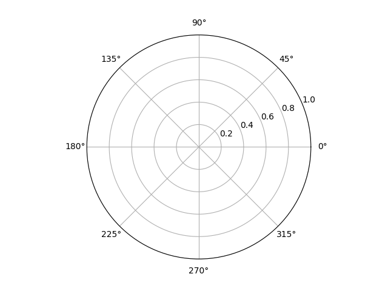
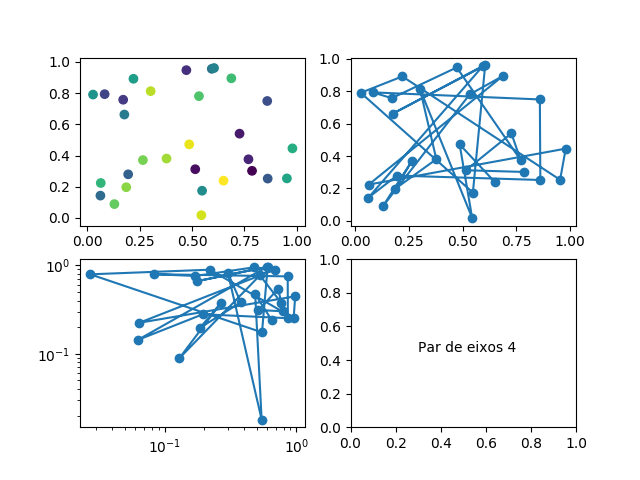

### O que é matplotlib?

O pacote [matplotlib](https://matplotlib.org/) é voltado para criação de
gráficos de alta qualidade e é muito usado hoje no meio científico, além de
ser software livre. Este tutorial introduz a essência do que se deve saber
para trabalhar com o `matplotlib`, e também serve como _cheat sheet_, por
isso está organizado em seções.

### A interface pyplot e a função plot

Há maneiras diferentes de se produzir a mesma coisa com o matplotlib. Para a
maioria dos usos, a maneira mais simples é a melhor, e isto é o que oferece
o pacote `matplotlib.pyplot`. Ele é uma interface simples que permite fazer
gráficos rapidamente e sem usar programação orientada a objetos, mas usando
uma sequência de ''comandos''. Ele é classicamente importado como `plt`:

~~~ python
import matplotlib.pyplot as plt
~~~

Para fazer um gráfico simples, usamos a função `plot`. Ela recebe um número
arbitrário de argumentos e é muito versátil. O mais comum é usá-la da
seguinte forma:

~~~ python
plt.plot(x, y, formato)
~~~

Aqui, `x` é uma sequência de coordenadas horizontais: pode ser uma tupla,
uma lista ou um array unidimensional. Analogamente, `y` é uma sequência de
coordenadas verticais. As sequências devem ter o mesmo tamanho. O parâmetro
`formato` é uma string especificando rapidamente o estilo do gráfico (por
exemplo: incluindo os caracteres `r`, `g` ou `b` o gráfico fica com cor
vermelha, verde ou azul; `-` indica uma linha sólida e `--` uma linha
tracejada; `o`, `s` e `^` fazem marcadores em cima de cada ponto com formato
de bolinha, quadrado ou triângulo). O parâmetro `formato` é *opcional*, e
por padrão o gráfico é feito com uma linha sólida ligando os pontos
especificados. É possível passar parâmetros adicionais; veja [a
documentação](https://matplotlib.org/api/_as_gen/matplotlib.pyplot.plot.html)
para uma discussão detalhada.

Por exemplo, vamos graficar as funções $$y = x$$, $$y = x^2$$ e $$y = x^3$$.
O primeiro passo é gerar os valores de `x` que serão usados; aqui, usamos a
função `linspace`. Em seguida graficamos as funções com a função `plot` e
executamos o comando `plt.show()` para mostrar o gráfico na tela:

~~~ python
x = np.linspace(0, 2, 21) # 21 pontos no intervalo [0, 2]
plt.plot(x, x)            # função y = x
plt.plot(x, x**2)         # função y = x^2
plt.plot(x, x**3)         # função y = x^3
plt.show()
~~~

Salve este código num arquivo Python e o execute (não esqueça de importar o
NumPy e o pyplot!). O resultado é a figura:

Com pouco trabalho já conseguimos um gráfico razoável: o pyplot
automaticamente ajustou as escalas e deu cores diferentes para cada gráfico.
Podemos personalizar um pouco adicionando strings de formato:

~~~ python
x = np.linspace(0, 2, 21)
plt.plot(x, x, 'b--')   # linha azul (b) tracejada (--)
plt.plot(x, x**2, 'go') # nenhuma linha, bolinhas (o) verdes (g)
plt.plot(x, x**3, 'r^') # nenhuma linha, triângulos (^) vermelhos (r)
plt.show()
~~~

Por último, podemos nos preocupar com detalhes. Por exemplo, vamos colocar
legendas (parâmetro `label`, função `legend`), um título no gráfico
(`title`), descrições nos eixos coordenados (`xlabel` e `ylabel`) e uma
grade para facilitar a leitura do gráfico (`grid`):

~~~ python
x = np.linspace(0, 2, 21)
plt.plot(x, x, 'b--', label='linear')
plt.plot(x, x**2, 'go', label='quadrático')
plt.plot(x, x**3, 'r^', label='cúbico')
plt.xlabel('teste x')
plt.ylabel('teste y')
plt.title('Gráfico simples')
plt.legend()
plt.grid()
plt.show()
~~~

Agora que tudo está pronto, basta salvar o gráfico como um arquivo de
imagem. Você pode fazer isto diretamente da tela interativa que surge ao
rodar o comando `show` (mais detalhes adiante). Isto encerra nosso
primeiro exemplo.

Perceba que a função `plot` toma coordenadas (x, y) e registra os pontos
correspondentes na imagem *em sequência*. Isto nos permite graficar não só
funções, mas qualquer curva parametrizada. Por exemplo, uma elipse centrada
na origem:

~~~ python
t = np.linspace(0, 2*np.pi, 100)
x, y = 2*np.cos(t), np.sin(t)
plt.axis('equal')   # iguala as escalas horizontal e vertical
plt.plot(x, y)
plt.show()
~~~

Nos dois exemplos acima, os limites de cada eixo foram escolhidos
automaticamente pelo pyplot --- embora, no segundo caso, tenhamos restrito
as escalas a ficarem iguais. Podemos escolher manualmente os limites dos
eixos com as funções `xlim` e `ylim`:

~~~ python
x = np.linspace(0, 2, 61)
plt.plot(x, x)
plt.plot(x, 1 / x)
plt.plot(x, 1 / x**2)
plt.xlim(0, 2)  # de 0 até 2 na horizontal
plt.ylim(0, 4)  # de 0 até 4 na vertical
plt.show()
~~~

Se, além do mais, nossos dados têm incertezas e queremos incluir barras de
erro nos gráficos, usamos a função `errorbar` no lugar de `plot`. O uso é
bastante similar:

~~~ python
plt.errorbar(x, y, yerr, xerr, formato)
~~~

Os primeiros parâmetros, `x` e `y`, são as coordenadas dos pontos e
funcionam como em `plot`. Todos os parâmetros seguintes são opcionais. Se
`y` é um array de formato `(N,)`, então `yerr`, que representa os erros em
`y`, pode ser:

- um escalar: neste caso o erro em `y` é simétrico e idêntico em todos os
  pontos
- um array de formato `(N,)`: o erro é simétrico mas varia de ponto a ponto
- um array de formato `(2, N)`: o erro na direção positiva é diferente do
  erro na direção negativa e varia de ponto a ponto. Primeira linha contém
  os erros na direção negativa, e a segunda, os erros na direção positiva.

O mesmo vale para `xerr`. Além disso, `formato` é uma string que segue as
mesmas regras que existiam para `plot`. Você também pode passar parâmetros
adicionais que controlam pormenores; veja [a
documentação](https://matplotlib.org/api/_as_gen/matplotlib.pyplot.errorbar.html).

Um exemplo simples do uso de `errorbar`:

~~~ python
# simula dados experimentais com erros aleatórios
x = np.arange(0, 11)
y = 5 * np.sin(x / 7.0) + np.random.normal(0, 0.15, 11)
erroy = 0.3 + 0.05 * y

# simula um 'modelo teórico'
tx = np.linspace(0, 10.5, 100)
ty = 5 * np.sin(tx / 7)

plt.plot(tx, ty, label='Teórico')
plt.errorbar(x, y, erroy, fmt='ks', label='Experimental')
plt.legend()
plt.grid()
plt.show()
~~~

As funções `plot` e `errorbar` são suficientes para a maioria dos gráficos
do dia-a-dia. Além de `errorbar`, há outras funções que funcionam de maneira
similar a `plot`:

- `scatter`: faz gráficos de dispersão
- `semilogx`, `semilogy`, `loglog`: faz gráficos simples em escala
  logarítmica
- `polar`: faz gráficos simples em coordenadas polares

Também vale a pena mencionar aqui as funções:

- `bar` e `barh`: fazem gráficos de barras
- `pie`: faz gráficos de pizza
- `hist` e `hist2d`: fazem histogramas
- `contour`: faz gráficos de contorno (curvas de nível de função escalar)
- `imshow`: mostra imagens 2D
- `quiver`: mostra um campo de vetores 2D
- `streamplot`: mostra linhas de fluxo de um campo vetorial 2D

Há muito mais que estas. O matplotlib é uma biblioteca muito completa!
Veja os links no final do tutorial para saber mais.

### Usando o pyplot interativamente

Até aqui, usamos o matplotlib apenas escrevendo scripts, salvando em arquivos
`.py`, e executando no terminal. Isto não é muito prático. A maneira mais
rápida de explorar seus dados, sejam de um experimento ou de uma simulação,
é fazer um gráfico interativo. Para isso, entre num shell interativo do
Python. Vamos começar importando nossos suspeitos usuais:

~~~ python
import numpy as np
import matplotlib.pyplot as plt
~~~

Ativamos o modo interativo do pyplot com a função `ion()`:

~~~ python
plt.ion()
~~~

(Analogamente, para desativar, usamos `ioff()`.)

Veja o que acontece agora quando fazemos um gráfico qualquer. Execute no
shell do Python

~~~ python
x = np.linspace(0, 2, 41)
plt.plot(x, x * x)
~~~

Sequer é preciso usar o comando `show()`. O matplotlib automaticamente abre
uma janela interativa com o gráfico. Mantenha-a aberta e execute

~~~ python
plt.plot(x, np.cos(x))
~~~

Você deve estar vendo um novo gráfico de linha desenhado automaticamente.
Na janela interativa, é possível ampliar e navegar pelo gráfico, além de
salvar uma cópia em PNG. A possibilidade de mudar parâmetros do seu gráfico
e ver as mudanças acontecerem *imediatamente* torna o modo interativo muito
prático para tarefas do dia-a-dia.

Mantenha o modo interativo ligado nas seções seguintes.

### Controlando o tamanho da figura

Quando executamos o comando `plot` acima, uma figura foi automaticamente
criada e exibida. Podemos criar uma figura sem graficar nada, como uma tela
em branco:

~~~ python
plt.figure()
~~~

Executando este comando no modo interativo, uma nova figura em branco deve
aparecer. Se você usar a função `plot` agora, é *nesta* figura que os
gráficos serão desenhados. O pyplot interpreta seus comandos *em contexto*:
um gráfico sempre vai para a última figura que foi selecionada. Para não se
confundir, é uma boa ideia usar apenas uma figura por vez no modo
interativo.

A primeira coisa que pode-se querer alterar numa figura é o tamanho. O
matplotlib armazena o tamanho de uma figura como um par `(largura, altura)`
em polegadas. Para alterá-lo, use o parâmetro `figsize`:

~~~ python
plt.figure(figsize=(6, 6))  # Figura quadrada de lado 6 polegadas
~~~

O segundo parâmetro importante é a densidade de pontos, que é o número de
pixels por polegada. Por exemplo, numa densidade de 100 PPP (pontos por
polegada, ou DPI, *dots per inch*), a figura acima tem resolução $$600
\times 600$$. Isto pode ser alterado com o parâmetro `dpi`:

~~~ python
plt.figure(figsize=(6, 6), dpi=120)  # Figura 720x720
~~~

Note que estes comandos criam *novas* figuras com os parâmetros
especificados. Se estivéssemos fazendo gráficos num script (um arquivo
`.py`), bastaria por a linha de código acima antes de todos os usos do
pyplot, o que garantria que a figura criada inicialmente já tivesse os
parâmetros desejados. No modo interativo, faz mais sentido alterar a *figura
atual*, que pode já conter gráficos etc. que não queremos jogar fora. Para
obter a figura atual, usamos a função `gcf()`:

~~~ python
fig = plt.gcf()
~~~

Daí, fazemos as alterações que queremos com os métodos `set_size_inches()` e
`set_dpi()`:

~~~ python
fig.set_size_inches(6, 6)
fig.set_dpi(120)
~~~

Você pode limpar a figura *atual* com o comando:

~~~ python
plt.clf()
~~~

Cuidado: isto elimina todos os gráficos na figura.

### Controlando as escalas de um par de eixos

Quando usamos a função `plot` acima, o matplotlib automaticamente criou uma
figura, que, como vimos, tem parâmetros que talvez queiramos alterar. A
segunda coisa que o matplotlib criou automaticamente foi um *par de eixos*,
que delimitam uma região da figura onde o nosso gráfico vive. Este também
pode ser criado independentemente do gráfico:

~~~ python
plt.axes()
~~~

Executando isto, você deve ver uma figura com um par de eixos em branco.
Qualquer `plot` executado em seguida vai desenhar gráficos nesse par de
eixos. Como no caso da figura, podemos controlar parâmetros do par de eixos
na sua criação. Por exemplo, mudar a projeção para polar, ou a escala em y
para logarítmica:

~~~ python
# Cria um par de eixos polar
plt.axes(projection='polar')
~~~

~~~ python
# Cria um par de eixos com escala logarítmica na vertical
ax = plt.axes(yscale='log')
ax.plot([1, 2, 3, 4], [1, 12, 31, 210])
~~~

A função `axes()` retorna o par de eixos criado. No entanto, novamente, se
estamos no modo interativo podemos não ter feito nada disso inicialmente e
já ter um gráfico que não queremos perder. Neste caso queremos alterar o
par de eixos *atual*. Ele pode ser obtido com a função `gca()`:

~~~ python
ax = plt.gca()
~~~

Então alteramos as propriedades desejadas:

~~~ python
ax.set_xlim(0, 2)    # Equivalente a plt.xlim(0, 2)
ax.set_title('olá')  # Equivalente a plt.title('olá')
ax.set_xscale('log') # Equivalente a plt.xscale('log')
~~~

O par de eixos atual pode ser limpo com o comando:

~~~ python
plt.cla()
~~~

Em geral, as propriedades do par de eixos *atual* podem ser alteradas
diretamente por funções do `pyplot`, sem fazer nada do procedimento acima.
No entanto, é útil saber lidar com pares de eixos se quisermos fazer mais de
um gráfico na mesma figura, como na seção seguinte.

### Fazendo mais de um gráfico na mesma figura

Uma figura pode conter vários pares de eixos, isto é, vários gráficos
diferentes. Como exemplo, vamos criar uma grade igualmente espaçada de
gráficos usando a função `subplots()`:

~~~ python
fig, axarray = plt.subplots(2, 2) # duas linhas e duas colunas de gráficos
(ax1, ax2), (ax3, ax4) = axarray  # dá nomes individuais para os pares de
                                  # eixos

# gera dados aleatórios
x, y = np.random.random(30), np.random.random(30)

# faz gráficos diferentes em cada par de eixos
ax1.scatter(x, y, c=np.arange(30))
ax2.plot(x, y, 'o-')
ax3.loglog(x, y, 'o-')
ax4.text(.3, .45, 'Par de eixos 4')
~~~

No código acima, o primeiro parâmetro passado para a função `subplots()` é o
número de linhas e o segundo é o número de colunas da grade.

Uma outra opção é a função `subplot()`, que cria apenas um par de eixos por
vez. Ela é chamada como

~~~ python
ax = plt.subplot(nlinhas, ncolunas, indice)
~~~

isto é, passamos o número de colunas, o de linhas, e o *índice* que
identifica o par de eixos que queremos: o índice é contado de `1` até
`ncolunas * nlinhas`, da esquerda para a direita, de cima para baixo (como
se lê). A função retorna o par de eixos `ax` e também o faz o par de eixos
*atual*, isto é, logo após a chamada acima, um `plt.plot()` faz um gráfico
no par de eixos `ax`, e é portanto equivalente a `ax.plot()`. A última forma
é preferível porque continua valendo depois de criarmos outros gráficos.
Um exemplo pode esclarescer melhor (execute linha por linha no modo
interativo):

~~~ python 
# Cria uma nova figura
fig = plt.figure(figsize=(8, 5))
# Esta é a figura *atual* no contexto do pyplot, como você pode verificar
# com
print(fig == plt.gcf())

# Vamos dividir a figura numa grade 2x3 e colocar um gráfico na primeira
# posição. No contexto, as duas linhas a seguir são equivalentes:
ax1 = fig.add_subplot(2, 3, 1)
ax1 = plt.subplot(2, 3, 1)

# Como acabou de ser criado, ax1 é o par de eixos *atual*, o que você
# pode verificar com
print(ax1 == plt.gca())

# Vamos fazer um gráfico simples em ax1. No contexto, as duas linhas a
# seguir são equivalentes:
ax1.plot([0, 1], [1, 2])
plt.plot([0, 1], [1, 2])

# Vamos criar outros eixos nas posições 2, 3, 4 e 5:
ax2 = fig.add_subplot(2, 3, 2)
ax3 = fig.add_subplot(2, 3, 3)
ax4 = fig.add_subplot(2, 3, 4)
ax5 = fig.add_subplot(2, 3, 5)

# Agora ax5 é o par de eixos atual. No entanto, como guardamos ax2 numa
# variável, ainda podemos fazer gráficos em ax2:
ax2.plot([0, 1], [3, 2])  # grafica em ax2
plt.plot([1, 3], [2, 2])  # grafica em ax5

# Finalmente, em vez de preencher a posição 6, vamos fazer um gráfico que
# ocupe toda a terceira coluna da figura. Ou seja, vamos dividir a figura
# numa grade 1x3 e criar um subplot ocupando a terceira posição:
ax3.remove()                         # remove ax3 da figura para abrir
axgrande = fig.add_subplot(1, 3, 3)  # espaço para axgrande

# Rearranja os gráficos para não haver interseção de eixos, legendas etc
plt.tight_layout()
~~~

O resultado final deve ser a figura:

### Fazendo muitos gráficos semelhantes

Quando se explora dados, especialmente de simulações, é comum querer fazer
muitos gráficos semelhantes para comparação (alterando apenas alguns
parâmetros). Neste caso, vale a pena escrever uma *função* que crie seu
gráfico com os parâmetros desejados. Uma das utilidades da maquinaria que
exploramos acima (os pares de eixos, objetos do tipo `Axes`) é facilitar
este tipo de trabalho.

Se tomarmos o par de eixos em que o gráfico será criado como *parâmetro*,
livramos a nossa função da responsabilidade de posicionar este par de eixos
numa figura, ou de exibir/exportar a figura.  Isto nos dá liberdade para
usar a função *repetidas vezes* e, além disso, *modificar* o gráfico que ela
gerou antes de finalizar o trabalho. Esta flexibilidade é muito útil.

Por exemplo, usando um pouco de SciPy, vamos criar uma função que gere
gráficos das funções harmônicas esféricas, dependendo dos parâmetros
inteiros `m` e `l` e da resolução desejada:

~~~ python
from scipy.special import sph_harm

# Grafica o harmônico esférico de grau l e ordem m (|m| <= l)
def graf_harmonico(ax, m, l, resol=50, **params):
    # Gerando os dados
    phi = np.linspace(0, 2*np.pi, 2*resol)  # azimutal
    theta = np.linspace(0, np.pi, resol)    # polar
    phi, theta = np.meshgrid(phi, theta)
    z = sph_harm(m, l, phi, theta)

    # Graficando a função
    ax.contourf(phi, theta, z, **params)

    # Removendo marcadores dos eixos
    ax.set_xticks([])
    ax.set_yticks([])
~~~

Agora podemos graficar, por exemplo, todos os harmônicos esféricos até grau
3:

~~~ python
N = 3  # grau máximo dos harmônicos a graficar

plt.figure(figsize=(9, 5))

for l in range(N+1):
    for m in range(-l,l+1):
        # (São necessárias 2N+1 colunas e N+1 linhas)
        ax = plt.subplot(N+1, 2*N+1, N+m+1 + (2*N+1)*l)

        graf_harmonico(ax, m, l, cmap='magma') 

plt.tight_layout()
~~~

Neste caso, o parâmetro adicional `cmap` (que controla as cores dos
gráficos) foi repassado para a função `contourf()` através de `params`. O
resultado é:

### Mudando o estilo de um gráfico

É possível controlar cada mínimo detalhe estético de um gráfico --- largura
das linhas, opacidade dos pontos, cores de preenchimento, bordas, fontes,
tamanhos --- mas na prática é mais fácil usar um conjunto de configurações
pronto que funcione em harmonia. O matplotlib fornece vários *estilos* além
do padrão, que viemos usando até aqui. Você pode visualizar uma lista deles
com o comando:

~~~ python
print(plt.style.available)
~~~

A função `plt.style.use()` serve para escolher um (ou mais) tema(s). Depois
que ela é usada, todas as funções do pyplot se comportam de acordo com o
tema. O tema padrão é `'classic'`. Mudando, por exemplo, para o tema
`'ggplot'`:

~~~ python
x = np.linspace(0, 4, 50)
plt.style.use('ggplot')
plt.plot(x ** 2, x)
~~~

### Exportando uma figura

Por fim, podemos exportar figuras do matplotlib em formatos diferentes:
como imagem em PNG (compressão sem perdas) ou JPEG (com perdas), como
desenho vetorizado em SVG, ou como documentos prontos para impressão em PDF
ou PS. Em todo caso, usamos a função `savefig()`, cuja chamada é

~~~ python
plt.savefig(fname)
~~~

onde `fname` é o nome do arquivo, donde se infere seu formato pela extensão.
Há também parâmetros opcionais, dos quais destacamos
- `dpi`: é a densidade de pixels, em pontos por polegada. Se não for
  especificado, será a densidade da figura atual. Em geral, vale a pena
  salvar figuras numa densidade maior que a que se usa para visualização.
- `bbox_inches`: é a região da figura que será renderizada. Se for a string
  `'tight'`, o matplotlib procura ajustar os limites para que tudo fique
  dentro da imagem final (nenhum título/nome de eixo etc. é cortado).

Assim, comandos típicos de exportação são:

~~~ python
# O mesmo que salvar a partir da tela interativa
plt.savefig('figura.png')

# Um pouco melhor: não corta labels e títulos. Bom para slides
plt.savefig('figura.png', bbox_inches='tight')

# Salva um PNG de alta qualidade. Um pouco melhor para impressão
plt.savefig('figura.png', dpi=300, bbox_inches='tight')

# Salva a figura em PDF. O DPI é irrelevante: os elementos do gráfico são
# vetorizados, ficam com "resolução infinita". É o melhor para a maioria das
# impressões. Não é uma boa ideia se houver transparências na figura (PDF 
# não suporta transparências bem)
plt.savefig('figura.pdf', bbox_inches='tight') 
~~~

Se você estiver usando $$\LaTeX$$, a imagem em PDF pode ser carregada
exatamente da mesma forma que a imagem PNG (com o comando `includegraphics`
do pacote `graphicx`), com as vantagens de tornar o texto no gráfico
pesquisável e a resolução tão grande quanto se queira, além de diminuir o
tamanho do arquivo final. Esta opção é recomendável na maioria dos casos.

Isto encerra o tutorial.

### Links úteis de matplotlib

- [Documentação completa do
  matplotlib](https://matplotlib.org/api/index.html): é grande, contém muito
  mais do que cobrimos aqui.
- [Tutoriais oficiais do
  matplotlib](https://matplotlib.org/tutorials/index.html): **fortemente
  recomendados**. Cobrem do básico ao avançado. O melhor recurso para aprender
  `matplotlib`.
- [Sumário do
  pyplot](https://matplotlib.org/api/pyplot_summary.html): contém
  todas as funções da interface `matplotlib.pyplot`.
  - [API da classe Axes](https://matplotlib.org/api/axes_api.html): descreve
  tudo que há para saber sobre os ''pares de eixos''.

## Exercícios

1. *Polinômios de Taylor*. Faça um gráfico da função $$\sin x$$ e de seus
   primeiros polinômios de Taylor, $$P_1(x) = x$$, $$P_3(x) = x - x^3/6$$ e
   $$P_5(x) = x - x^3/6 + x^5/120$$, no intervalo $$[-\pi, \pi]$$.

1. Faça um gráfico das funções $$y = x$$, $$y = x^2$$, $$y = x^3$$ em escala
   logarítmica usando a função `loglog`, no intervalo $$[1, 100]$$. (O
   gráfico deve ter três retas.)

1. *Órbitas keplerianas*. Desenhe uma elipse com foco na origem, cuja
   equação em coordenadas polares $$(r, \theta)$$ é dada por

   $$ r (e \cos \theta + 1) = \ell $$

   Aqui, $$0 \leq e < 1$$ é a excentricidade e $$\ell$$ é um parâmetro que
   controla o tamanho da figura. (Dica: faça um array de valores $$\theta$$
   entre 0 e $$2\pi$$, use a equação para obter um array correspondente de
   valores $$r$$, e então plote $$x = r \cos \theta$$ e $$y = r \sin
   \theta$$).

1. Repita o exercício acima usando a função `polar`.

1. Exporte um gráfico como PDF e um como PNG. Mude o estilo de algum deles
   para `'ggplot'`.

## Licença

Este trabalho está licenciado sob a Licença
Atribuição-NãoComercial-CompartilhaIgual 4.0 Internacional (BY-NC-SA 4.0
internacional) Creative Commons. Para visualizar uma cópia desta licença,
visite <http://creativecommons.org/licenses/by-nc-sa/4.0/>.
