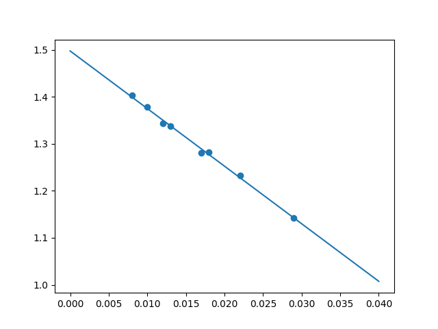
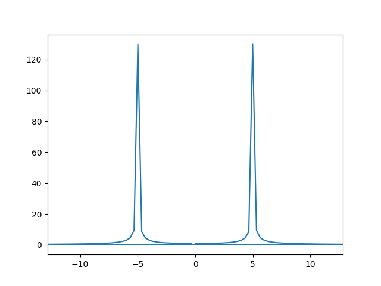
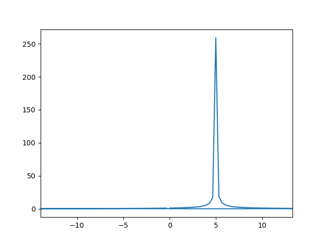
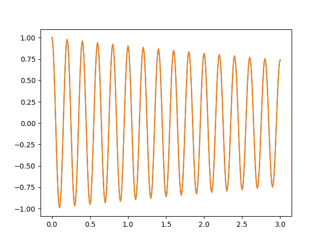
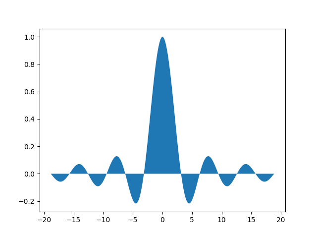
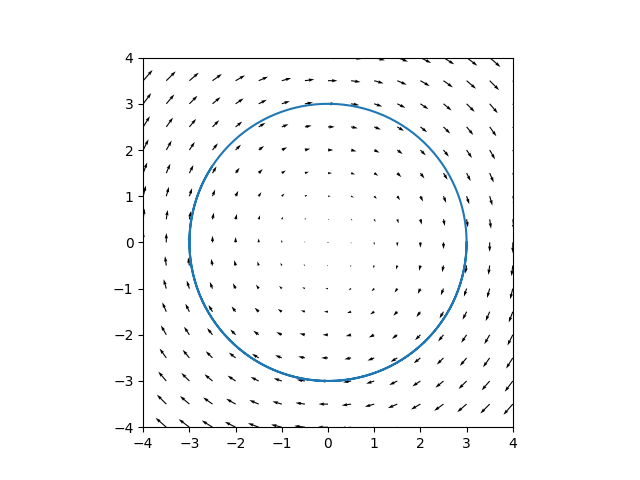
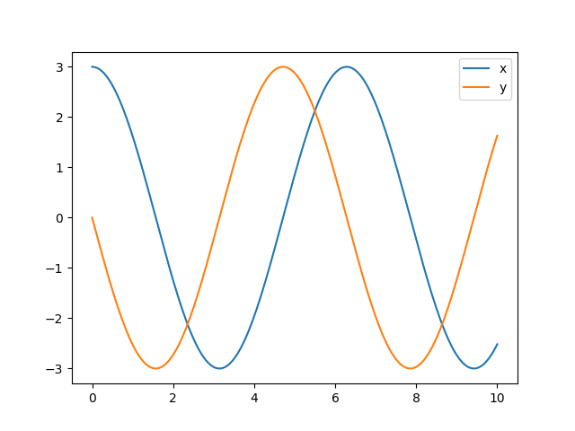
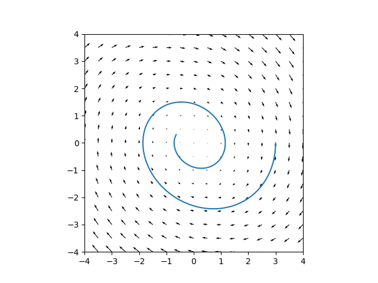
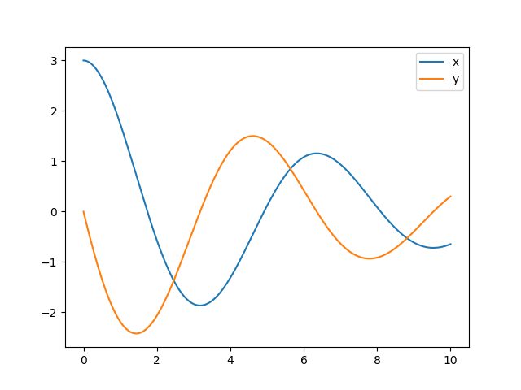

### O que é SciPy?

O projeto [SciPy](https://www.scipy.org/) é uma coleção de bibliotecas
Python open-source para matemática, ciência e engenharia, incluindo o NumPy
e o matplotlib. Por outro lado, parte do projeto é a
*biblioteca* `scipy`, que chamaremos apenas de SciPy. Ela contém como
submódulos a maioria das ferramentas que se espera de um software para
cientistas, incluindo funções especiais, integração, otimização,
interpolação, transformadas de Fourier, processamento de sinais, álgebra
linear, estatística e processamento de imagens. Veja [este
link](https://docs.scipy.org/doc/scipy/reference/).

Nosso tutorial cobre apenas algumas tarefas comuns que ilustram o uso da
biblioteca e, como os anteriores, está dividido em seções para facilitar a
consulta. Cada seção é um exemplo independente, e elas podem ser lidas em
qualquer ordem.

Antes de tudo, importe o NumPy e o pyplot:

~~~ python
import numpy as np
import matplotlib.pyplot as plt
~~~

### Ajustando parâmetros de curvas com `curve_fit()`

`curve_fit()` é uma função do módulo `scipy.optimize`. Ela recebe uma função
e um conjunto de dados, e retorna os parâmetros da função que a ajustam
melhor aos dados segundo o critério dos mínimos quadrados. Isto é, dada uma
função $$f(x, \lambda)$$, na variável $$x$$ com parâmetro $$\lambda$$, e um
conjunto de dados experimentais $$(x_j, y_j)$$, o `curve_fit()` encontra o
parâmetro $$\lambda$$ tal que a soma

$$ \sum_j (y_j - f(x_j, \lambda))^2 $$

é mínima. Isto também é chamado *regressão*.

A chamada da função `curve_fit()` tem a forma típica:

~~~ python
curve_fit(func, dadosx, dadosy, p0, errosy)
~~~
`func()` é a função cujos parâmetros se deseja descobrir; ela recebe a
variável primeiro e os parâmetros depois: `func(x, a, b, ...)`. `dadosx` e
`dadosy` são sequências (arrays) de dados, onde x é a variável independente
e y é dependente. `p0` é um palpite inicial para os valores dos parâmetros,
e portanto é uma lista de tamanho igual ao número de parâmetros que a função
recebe (não contando a variável dependente `x`). `errosy` é uma sequência
*opcional* que indica os erros nas medidas da variável dependente. Supõe-se
que os erros em x são desprezíveis (se isto não for verdade, há métodos mais
complicados que podem lidar também com erros em x).

Vejamos um caso simples. Como fazer a regressão de uma reta com o
`curve_fit()`?

Primeiro definimos a função `func` que será ajustada. Ela tem dois
parâmetros: o coeficiente angular `a` e o coeficiente linear `b`:

~~~ python
def func(x, a, b):
    return a*x + b
~~~

Agora, os dados. Vamos usar a seguinte tabela (`dados.dat`):

~~~
8e-3    1.403
10e-3   1.378
12e-3   1.344
13e-3   1.338
17e-3   1.280
18e-3   1.282
22e-3   1.232
29e-3   1.142
~~~

Carregando como array do numpy:

~~~ python
x, y = np.loadtxt('dados.dat').T
~~~

Agora usamos a função `curve_fit`. Ela retorna uma lista de parâmetros e uma
*matriz de covariância*. Vamos chamar a primeira de `params` e a segunda de
`mcov`:

~~~ python
from scipy.optimize import curve_fit
params, mcov = curve_fit(func, x, y)
~~~

Os elementos da diagonal de `mcov` são as variâncias de `a` e `b`, ou seja,
o quadrado dos desvios-padrão, que identificamos como o erro associado aos
parâmetros `a` e `b`:

~~~ python
a, b = params
a_err, b_err = np.sqrt(np.diag(mcov))
~~~

Vamos graficar reta ajustada e os pontos da tabela para ver o que está
acontecendo:

~~~
t = np.array([0, 0.04])
plt.scatter(x, y)
plt.plot(t, func(t, a, b))
~~~

Um excelente ajuste! Se quisermos os valores dos parâmetros:

~~~ python
print(a, a_err)
print(b, b_err)
~~~

O que fizemos acima é absolutamente genérico e se aplica a qualquer tipo de
função. Vamos a um exemplo mais complicado. A lei de Planck

$$ B_\nu(\nu, T) = \frac{2h\nu^3}{c^2} \frac{1}{e^{\frac{h\nu}{kT}} - 1} $$

dá o espectro de um corpo negro em função da frequência $$\nu$$ para uma
determinada temperatura $$T$$. Vamos supor que, das constantes que aparecem
na equação, apenas o valor de $$c$$ é conhecido, mas temos estimativas das
ordens de grandeza de $$h$$ e $$k$$. Também conhecemos a temperatura $$T$$
do experimento. Podemos determinar as constantes $$h$$ de Planck e $$k$$ de
Boltzmann com um único ajuste de curva. Por exemplo, suponha que temos os
seguintes dados experimentais salvos em `corponegro.dat`:

~~~
# T = 300 K
# frequência, radiança espectral (unidades do SI)
0.50e13   1.02e-12
0.82e13   2.57e-12
1.14e13   4.42e-12
1.46e13   4.69e-12
1.79e13   5.35e-12
2.11e13   4.94e-12
2.43e13   4.55e-12
2.75e13   3.15e-12
3.07e13   3.22e-12
3.39e13   2.56e-12
3.71e13   1.90e-12
4.04e13   1.63e-12
4.36e13   1.02e-12
4.68e13   1.46e-12
5.00e13   0.41e-12
~~~

Então:

~~~ python
# Define a função (lei de Planck)
T, c = 300, 299792458
def Bnu_corpo_negro(nu, h, k):
    return 2*h*(nu**3/c**2) * (1 / (np.exp(h*nu/(k*T)) - 1))

# Carrega os dados
nu_dados, Bnu_dados = np.loadtxt('corponegro.dat').T

# Faz o ajuste com as estimativas iniciais 1e-34 e 1e-23 para h e k
params, mcov = curve_fit(Bnu_corpo_negro, nu_dados, Bnu_dados,
                         [1e-34, 1e-23])
h, k = params
h_err, k_err = np.sqrt(np.diag(mcov))
~~~

Obtivemos os parâmetros $$h = (6.3 \pm 0.5) \times 10^{-34} J \cdot s$$ e
$$k = (1.33 \pm 0.08) \times 10^{-23} J/K$$. Compare com os valores precisos
$$6.63 \times 10^{-34}$$ e $$1.38 \times 10^{-23}$$ --- nada mau!.
Finalmente, vamos graficar os dados e a curva ajustada:

~~~ python
plt.plot(nu_dados, Bnu_dados, 'o', label='Dados')
nu = np.linspace(1, 5.5e13, 100)
plt.plot(nu, Bnu_corpo_negro(nu, h, k), label='Ajuste')
plt.legend()
~~~

O `curve_fit` funciona por aproximações sucessivas: em cada iteração, ele
modifica um pouco os parâmetros para se aproximar do mínimo. Note que,
tentando fazer o ajuste com estimativas iniciais ruins (por exemplo, 0 ou 1)
o `curve_fit` não converge e não conseguimos a solução. É sempre bom ter uma
estimativa inicial ao menos na ordem de grandeza correta.

O módulo `scipy.optimize` também tem funções para cálculo de mínimos locais
e globais e para encontrar raízes e soluções de sistemas de muitas
variáveis. Consulte a documentação para saber mais.

### Transformadas de Fourier com o `fftpack`

O pacote `scipy.fftpack` faz transformadas de Fourier discretas e convoluções
(veja [o tutorial oficial](https://docs.scipy.org/doc/scipy/reference/tutorial/fftpack.html)
para uma discussão maior do que isto significa). Vamos ilustrar seu uso (e interpretação dos resultados) fazendo
transformadas de Fourier de funções 1D.

A _transformada de Fourier_ da função real (ou complexa) $$ f(t) $$ é uma função complexa $$ \tilde{f}(\nu) $$ da frequência $$ \nu $$. A ideia geral é decompor a função $$f(t)$$ como uma combinação de diversas oscilações harmônicas da forma $$e^{2\pi i \nu t}$$:

$$ f(t) = \int \tilde{f}(\nu) \, e^{2\pi i \nu t} \, d\nu $$

Assim o módulo de $$ \tilde{f}(\nu) $$ indica quão fortemente a frequência $$\nu$$ ''está presente'' no sinal $$ f(t) $$, enquanto seu argumento indica a fase da onda com esta frequência. Para nosso exemplo, vamos usar um sinal simples: uma onda senoide que cai exponencialmente com o tempo (como o som de um diapasão). 

Começamos importando o pacote:

~~~ python
from scipy import fftpack
~~~

Usando um shell interativo do Python, podemos gerar nosso sinal e exibir seu gráfico com o código

~~~ python
f = 5    # frequência em Hertz
fs = 100 # frequência de amostragem
T = 3    # tempo total
A = 0.1  # taxa de decaimento

t = np.linspace(0, T, T * fs + 1)
y = np.exp(-A*t) * np.cos(2*np.pi*f * t)
plt.plot(t, y)
plt.show()
~~~

É importante notar que esta é uma amostra _finita_ de pontos _igualmente espaçados_ da nossa função matemática $$ f(t) $$ _restrita a um intervalo_, como se espera de quaisquer dados reais (por exemplo, som). Nestas condições, pode-se aplicar o algoritmo _Fast Fourier Transform_ (FFT) para obter uma amostra também discreta, finita e igualmente espaçada da transformada $$ \tilde{f}(\nu) $$. É isto que as funções do `scipy.fftpack` fazem.

Para calcular nossa transformada, vamos usar as funções `fft` e `fftfreq`. A primeira calcula os valores da transformada, e a segunda nos ajuda a calcular as frequências $$ \nu $$ na amostra:

~~~ python
transf = fftpack.fft(y)
freqs = fftpack.fftfreq(len(y)) * fs
~~~

Agora (`freqs`, `transf`) nos dá o gráfico de $$ \tilde{f}(\nu) $$, assim como (`t`, `y`) nos deram antes o gráfico de $$ f(t) $$:

~~~ python
plt.plot(freqs, np.abs(transf))
plt.show()
~~~

Veja que há dois picos: um na frequência $$ \nu $$ = 5 Hz, e outro em $$ \nu $$ = -5 Hz. Isto era esperado, já que nosso sinal é essencialmente uma função cosseno, que se decompõe como

$$ \cos(x) = \dfrac{e^{ix} + e^{-ix}}{2} $$

Mais geralmente, qualquer sinal real tem transformada de Fourier simétrica em relação à origem (o que é usado para agilizar o cálculo, por exemplo, pela função `rfft`). Se fizermos agora um sinal complexo, podemos ter uma transformada não-simétrica, com um único pico:

~~~ python
y2 = np.exp((-0.1 + 2*np.pi*f*1j)*t)
transf2 = fftpack.fft(y2)
plt.plot(freqs, np.abs(transf2))
plt.show()
~~~

Finalmente, podemos inverter a operação, fazendo uma transformada _inversa_ de Fourier com a função `ifft`. Ela reconstrói totalmente o sinal original:

~~~ python
inv = fftpack.ifft(transf)
plt.plot(t, inv)
plt.plot(t, y)
plt.show()       # gráficos se sobrepõem
~~~

Para saber como fazer transformadas em $$n$$ dimensões, convoluções e outras coisas, consulte a documentação.

### Calculando integrais com `integrate`

O módulo `scipy.integrate` contém funções para cálculo de integrais (em qualquer número de dimensões) e solução de sistemas equações diferenciais ordinárias. Vamos exemplificar o uso de algumas delas.

O cálculo de uma integral definida também é conhecido como _quadratura_, e por isso o `integrate` fornece as funções `quad` para cálculo de integrais em uma dimensão, `dblquad` para integrais duplas, `tplquad` para triplas e `nquad` para integrais de dimensão qualquer. Essas funções são para uso genérico, fornecendo como resultado uma aproximação da integral e uma estimativa (cota superior) do erro.

Como exemplo, vamos calcular uma integral da função $$ \operatorname{sinc} (x) $$ com `quad`.
~~~ python
from scipy import integrate

# Exemplo: função sinc ('seno cardinal')
@np.vectorize
def f(x):
    if x == 0:
        return 1
    return np.sin(x) / x

# Intervalo de integração
a, b = -6*np.pi, 6*np.pi

# Mostrando a curva
x = np.linspace(a, b, 300)
y = f(x)
plt.fill_between(x, y)
plt.show()
~~~

O cálculo em si é feito em uma linha, dando como parâmetros à função `quad` nossa o integrando `f` e os limites de integração:

~~~
resultado = integrate.quad(f, a, b)
print(resultado)  # Retorna valor e estimativa de erro
~~~

Isto dá o resultado com 12 dígitos de precisão. Se mais precisão for desejada, isto pode ser especificado com o parâmetro `epsabs` (tolerância absoluta de erro). Veja [a documentação](https://docs.scipy.org/doc/scipy/reference/generated/scipy.integrate.quad.html#scipy.integrate.quad).

Para limites de integração infinitos, usamos o objeto `np.inf`. Por exemplo, podemos calcular

$$ \int_0^\infty e^{-x^2} dx = \dfrac{\sqrt{\pi}}{2} $$

com o código

~~~ python
def g(x):
    return np.exp(-x*x)
res, err = integrate.quad(g, 0, np.inf)
print(res, np.sqrt(np.pi)/2) # compara com resultado analítico
~~~

e analogamente usa-se `-np.inf` para $$ - \infty $$.

O `integrate` também pode fazer cálculos com sistemas de equações diferenciais ordinárias (EDOs). O problema mais comum é o _problema de valor inicial_ (PVI) -- dados valores das variáveis em $$ t = 0 $$, encontrar sua evolução temporal para $$ t > 0 $$. A função `odeint` se encarrega diretamente disto, resolvendo PVIs para sistemas de EDOs de ordem 1 (isto é, em que se especifica as primeiras derivadas de cada variável em termos de todas as variáveis, mas sem envolver derivadas de ordem superior).

Isto parece, mas não é uma restrição: na verdade, _todos_ os sistemas de EDOs podem ser reduzidos a sistemas de ordem 1 se transformarmos algumas derivadas em variáveis (aumentando a quantidade de equações). Por exemplo, a equação do oscilador harmônico

$$ \dfrac{d^2 x}{dt^2} = -x $$

é de segunda ordem, mas pode ser transformada num _sistema_ de equações de primeira ordem:

$$ \begin{cases}
\displaystyle \dfrac{dx}{dt} = y \\
\displaystyle \dfrac{dy}{dt} = -x \\
\end{cases} $$

o truque é exatamente tomar a _velocidade_ $$dx / dt$$ como uma nova variável $$y$$. Isto sempre pode ser feito para reduzir um sistema de qualquer ordem a um sistema de ordem 1.

Vamos aproveitar o exemplo e integrar o oscilador harmônico com as condições iniciais $$ x(0) = 3 $$, $$ \dot{x}(0) = 0 $$. Primeiro definimos o sistema de equações acima (que é um _campo vetorial_ no plano xy) pela função `campo1`:

~~~ python
def campo1(ponto, t):
    x, y = ponto
    return [y, -x]  # derivadas temporarais de x e y
~~~

Agora definimos o intervalo de integração `t` (um array do numpy) e as condições iniciais (uma lista de números):

~~~ python
t = np.linspace(0, 10, 200)  # integrar de t=0 até t=10
iniciais = [3, 0]            # x(0) e y(0)
~~~

Finalmente, passamos tudo para a função `odeint`, que retorna um array contendo as funções horárias $$ x(t) $$ e $$ y(t) $$:

~~~ python
x, y = integrate.odeint(campo1, [3, 0], t).T
~~~

Finalmente, podemos graficar o resultado, tanto em função do tempo como apenas como uma trajetória no plano xy (conhecido em física como _espaço de fase_), que é uma curva integral do campo `campo1`:

~~~ python
# Plot do campo e da trajetória no espaço de fase
ax = plt.gca()
X, Y = np.meshgrid(np.arange(-5, 5, .5),
                   np.arange(-5, 5, .5))
U, V = campo1([X, Y], 0)
ax.quiver(X, Y, U, V)
ax.plot(x, y)
ax.set_aspect('equal')
ax.set_xlim(-4, 4)
ax.set_ylim(-4, 4)
plt.show()

# Plot dos valores de x e y em função do tempo
plt.plot(t, x, label='x')
plt.plot(t, y, label='y')
plt.legend()
plt.show()
~~~

Analogamente, poderíamos resolver a equação do oscilador amortecido

$$ \dfrac{d^2 x}{dt^2} + a \dfrac{dx}{dt} + x = 0 $$

com a função de derivadas (agora dependente do parâmetro `a`)

~~~ python
def campo2(ponto, t, a):
    x, y = ponto
    return [y, -x - a*y]
~~~

A solução, desta vez, seria obtida passando-se para `odeint` a função `campo2`,  o intervalo de integração, os valores de $$ x $$ e $$ y $$ em $$ t = 0 $$ e também o valor do parâmetro $$ a $$, dado pelo parâmetro `args`. Se decidirmos usar as mesmas condições iniciais e $$ a = 0.3 $$:

~~~ python
x, y = integrate.odeint(campo2, [3, 0], t, args=(0.3,)).T
~~~

Dando o resultado

Para informações mais detalhadas (e resolver problemas mais específicos que PVIs com intervalos de integração fixos), veja a documentação do integrate.

#### Links úteis

- [Documentação completa do `scipy`](https://docs.scipy.org/doc/scipy/reference/)
- [Tutorial oficial do módulo
  `scipy.optimize`](https://docs.scipy.org/doc/scipy/reference/tutorial/optimize.html)
- [Documentação do
  `curve_fit`](https://docs.scipy.org/doc/scipy/reference/generated/scipy.optimize.curve_fit.html#scipy.optimize.curve_fit)
- [Tutorial oficial do módulo `scipy.fftpack`](https://docs.scipy.org/doc/scipy/reference/tutorial/fftpack.html)
- [Tutorial oficial do módulo `scipy.integrate`](https://docs.scipy.org/doc/scipy/reference/tutorial/integrate.html)

## Licença

Este trabalho está licenciado sob a Licença
Atribuição-NãoComercial-CompartilhaIgual 4.0 Internacional (BY-NC-SA 4.0
internacional) Creative Commons. Para visualizar uma cópia desta licença,
visite <http://creativecommons.org/licenses/by-nc-sa/4.0/>.
