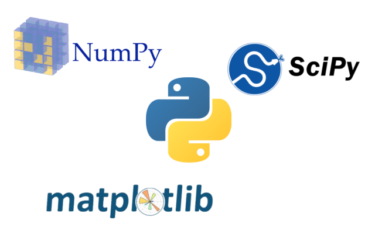

<h2 style="color:lightgreen">III SEnC - Introdução ao SciPy e ao matplotlib </h2>
<h1 style="color:lightgreen">Sejam bem-vindos!</h1>
Esperamos que estejam aproveitando a semana!

O GEPAC lhes dá as boas vindas ao **curso introdutório de SciPy, NumPy e matplotlib**.

Além do ministrante, teremos um monitor disponível durante todo o minicurso.
Sinta-se livre para chamar qualquer um dos dois caso surja alguma dúvida no
decorrer dessa aventura.

Ao final do curso, caso queira conhecer um pouco mais sobre essas
bibliotecas e como elas podem ser usadas de diversas formas para resolver
uma variedade de problemas, sinta-se livre para explorar nossos projetos
passados [aqui](https://gepac.github.io/) no site! Também forneceremos links
para a documentação e tutoriais oficiais dessas bibliotecas ao longo dos
textos.

Também fique ligado para as próximas atividades do Grupo seguindo a nossa
[página do Facebook](https://www.facebook.com/pac.ifsc/) e participando do
nosso [grupo no
WhatsApp](https://chat.whatsapp.com/EgfLUgRvFGb6rAoTLh4m7I) pelo QR code
abaixo:

  

## O que aprenderemos hoje?

Muitas vezes na física, nas outras ciências e nas engenharias nos deparamos
com problemas os quais não conseguimos (ou simplesmente não queremos)
resolver analíticamente.  Talvez tenhamos uma equação muito difícil, ou
então um arquivo enorme e cheio de dados, ou quem sabe só queremos alguns
gráficos bonitos para o relatório de Lab II.

Todos esses problemas podem ser resolvidos facilmente se tivermos as
ferramentas certas! E é isso (e muito mais) que o *ecossistema SciPy* nos
fornece.

O **NumPy** nos introduz os *arrays*: uma estrutura de certa forma similar
às listas do próprio Python, porém muito mais poderosa quanto à sua
capacidade para realizar cálculos numéricos com simplicidade. É com esses
arrays que trabalharemos em todas as outras bibliotecas.

O **SciPy** nos fornece uma série de ferramentas e funções para manipular e
trabalhar com nossos dados, e por fim o **matplotlib** nos permite
visualizar esses dados através de vários tipos de gráficos e figuras.

Juntas, essas três bibliotecas oferecem uma alternativa **gratuita** ao
MATLAB, além de contarem com todo o poder e versatilidade do Python.

Vale comentar também que elas funcionam muito bem em conjunto com outras
bibliotecas bem famosas para diversos propósitos, como o
[SymPy](https://www.sympy.org/en/index.html) para cálculo simbólico,
[Pandas](https://pandas.pydata.org/) para análise de dados,
[scikit-learn](https://scikit-learn.org/stable/) para Machine Learning,
[OpenCV](https://opencv.org/) para Visão Computacional e muito mais.

Espero que isso sirva de motivação para o que veremos a seguir. Estudaremos
com um pouco mais de profundidade cada uma dessas bibliotecas, e ao final
aplicaremos nosso conhecimento recém adquirido em alguns projetos que
simulam problemas reais com os quais poderíamos nos deparar.

## Cobriremos os seguintes temas:

### NumPy

1. O que é NumPy?
2. N-dimensional array (`ndarray`)
    - Estrutura
    - Tipos de dados
    - Slicing
    - Masking
3. Broadcasting
    - Operações com arrays
    - `vectorize` e `frompyfunc`
    - Funções universais
4. Usando tabelas de dados externas: `loadtxt` e `savetxt`

### matplotlib

1. O que é `matplotlib`?
1. A interface `pyplot` e a função `plot`
1. Usando o `pyplot` interativamente
1. Controlando o tamanho da figura
1. Controlando as escalas de um par de eixos
1. Fazendo mais de um gráfico na mesma figura
1. Fazendo muitos gráficos semelhantes
1. Mudando o estilo de um gráfico
1. Exportando uma figura

### SciPy

1. O que é SciPy?
1. Ajustando parâmetros de curvas com `curve_fit`
1. Transformadas de Fourier com o `fftpack`
1. Calculando integrais com `integrate`
1. Solução de sistemas de EDOs (exemplo: pêndulo)

## Abaixo o link do material:
- [Introdução ao NumPy]()
- [Introdução ao matplotlib]()
- [Introdução ao SciPy]()
- [Projeto final: o pêndulo caótico]()
